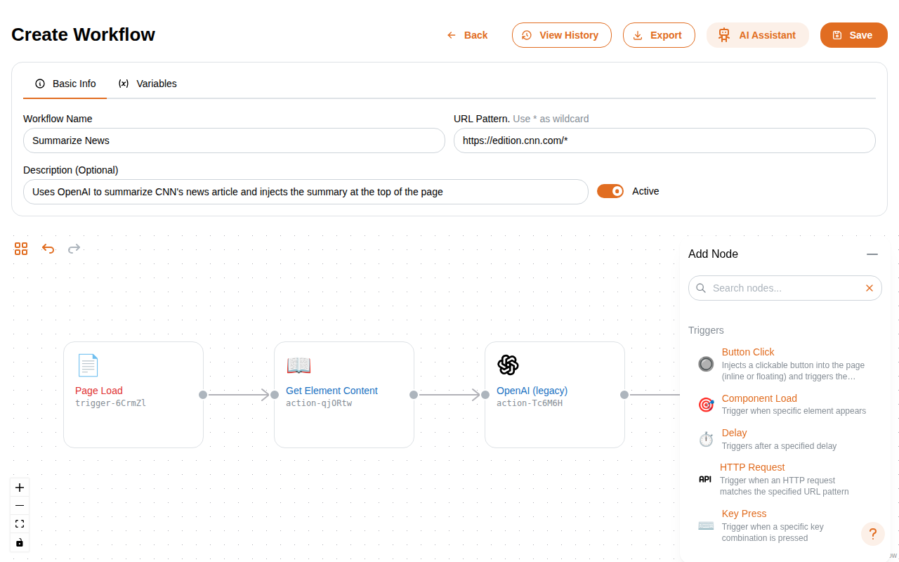
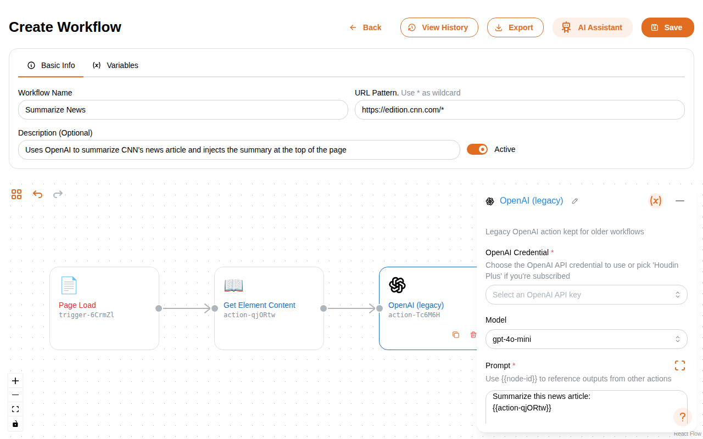
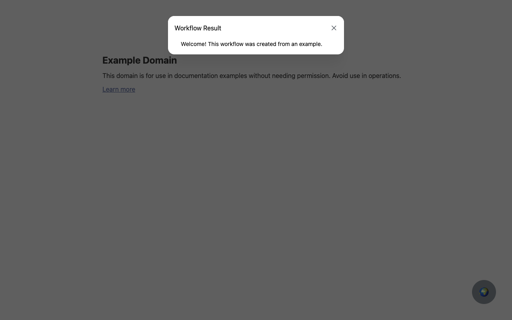

# Houdin

[](https://github.com/afonsocraposo/houdin/actions/workflows/release.yml)

> Browser automation that feels like magic ✨

Houdin is a powerful browser extension that enables visual workflow automation for web browsers. Create sophisticated automation workflows using a drag-and-drop interface, inject custom code, and automate repetitive tasks across any website.

## 🎬 Demo

https://github.com/user-attachments/assets/f69cf352-c0e5-4bf4-b49d-b7bd24c7297f

## 📸 Screenshots

### Workflow Management


_Manage your automation workflows with an intuitive interface_

### Visual Workflow Designer


_Drag-and-drop workflow designer with extensive action library_


_Configure action parameters with type-safe property editors_

### Execution History & Monitoring


_Monitor workflow execution with detailed logs and outputs_

### Live Automation


_Workflows execute seamlessly on any website_

## 🚀 Features

### Core Automation

- **Visual Workflow Designer**: Drag-and-drop interface for creating complex automation workflows
- **Element Interaction**: Click, type, and interact with web page elements
- **Smart Element Selection**: Built-in element selector with CSS/XPath support
- **Form Automation**: Automated form filling and submission
- **HTTP Requests**: Make API calls and handle responses within workflows

### Advanced Capabilities

- **Custom Scripts**: Execute JavaScript code with full page context
- **LLM Integration**: OpenAI integration for AI-powered automation
- **Modal & Notifications**: Display custom UI components on web pages
- **Style Injection**: Dynamically modify page appearance
- **Wait Conditions**: Smart waiting for page changes and elements

### Developer Experience

- **TypeScript**: Full type safety and IntelliSense support
- **React + Mantine**: Modern UI components and design system
- **Hot Reload**: Fast development with Vite
- **Cross-Browser**: Works on Chrome, Firefox, and Edge
- **Execution History**: Track and debug workflow runs

## 📦 Installation

### Development Setup

1. **Clone the repository**

   ```bash
   git clone <repository-url>
   cd houdin
   ```

2. **Install dependencies**

   ```bash
   npm install
   ```

3. **Start development server**

   ```bash
   npm run dev
   ```

4. **Load extension in browser**
   - Chrome: Go to `chrome://extensions/`, enable Developer mode, click "Load unpacked"
   - Firefox: Go to `about:debugging`, click "This Firefox", click "Load Temporary Add-on"

### Building for Production

```bash
npm run build
```

The built extension will be in the `dist/` directory.

## Adding a New Action or Trigger

Every node (action or trigger) follows a split pattern: a **definition** file (metadata, config schema, output shape) and a **runtime** file (execution logic).

### 1. Create the definition file

Define the node's metadata, configuration schema, and example output.

**`src/services/actions/my-action.definition.ts`** (or `src/services/triggers/my-trigger.definition.ts`):

```ts
import type { NodeDefinition } from "../node-definitions/types";
import { textProperty, selectProperty } from "@/types/config-properties";

const definition = {
  kind: "action",
  metadata: {
    type: "my-action",
    label: "My Action",
    icon: "⚡",
    description: "Description of what this action does",
    disableTimeout: true, // optional: disables timeout for long-running actions
    outputs: new Set(["true", "false"]), // optional: for branching nodes like "if"
  },
  configSchema: {
    properties: {
      myField: textProperty({
        label: "My Field",
        placeholder: "Enter value",
        description: "What this field does",
        required: true,
        defaultValue: "hello",
      }),
      myChoice: selectProperty({
        label: "My Choice",
        options: [
          { label: "Option A", value: "a" },
          { label: "Option B", value: "b" },
        ],
        defaultValue: "a",
      }),
    },
  },
  outputExample: {
    result: "Sample output data",
  },
} satisfies NodeDefinition;

export default definition;
```

Available property builders (from `@/types/config-properties`):
| Function | Type |
|---|---|
| `textProperty()` | Single-line text |
| `textareaProperty()` | Multi-line text |
| `numberProperty()` | Numeric input |
| `selectProperty()` | Dropdown with options |
| `booleanProperty()` | Toggle/checkbox |
| `colorProperty()` | Color picker |
| `codeProperty()` | Code editor (with `language` and `height`) |
| `credentialsProperty()` | Credential selector (with `credentialType`) |
| `customProperty()` | Custom React component (with `component`) |

All properties support `showWhen` for conditional visibility.

### 2. Create the runtime file

Implement the execution logic by extending `BaseAction` or `BaseTrigger`.

**`src/services/actions/my-action.runtime.ts`**:

```ts
import definition from "./my-action.definition";
import { BaseAction } from "@/types/actions";

interface MyActionConfig {
  myField: string;
  myChoice: string;
}

interface MyActionOutput {
  result: string;
}

export class MyAction extends BaseAction<MyActionConfig, MyActionOutput> {
  constructor() {
    super(definition);
  }

  async execute(
    config: MyActionConfig,
    workflowId: string,
    nodeId: string,
    onSuccess: (data?: MyActionOutput) => void,
    onError: (error: Error) => void,
  ): Promise<void> {
    try {
      const result = `You chose: ${config.myChoice}`;
      onSuccess({ result });
    } catch (err) {
      onError(err as Error);
    }
  }
}
```

For triggers, extend `BaseTrigger` and implement the `setup` method instead:

```ts
import definition from "./my-trigger.definition";
import { BaseTrigger } from "@/types/triggers";

export class MyTrigger extends BaseTrigger<MyTriggerConfig, MyTriggerOutput> {
  constructor() {
    super(definition);
  }

  async setup(
    config: MyTriggerConfig,
    workflowId: string,
    nodeId: string,
    onTrigger: (data: MyTriggerOutput) => Promise<void>,
  ): Promise<void> {
    // Set up event listeners, observers, etc.
    // Call onTrigger(data) when the event occurs
  }
}
```

### 3. Register the runtime

Add the import and registration to the appropriate initializer.

**`src/services/actionInitializer.ts`** (or `src/services/triggerInitializer.ts`):

```ts
import { MyAction } from "./actions/my-action.runtime";
// ...
registry.register(MyAction);
```

### 4. Add to the node catalog

Import the definition in the catalog index.

**`src/services/node-definitions/actions.ts`** (or `src/services/node-definitions/triggers.ts`):

```ts
import my_action from "../actions/my-action.definition";
// ...
export const actions: NodeDefinitionRecord = {
  // ...
  "my-action": my_action,
};
```

## 🛠 Development Scripts

- `npm run dev` - Start development server with hot reload
- `npm run dev:firefox` - Build for Firefox with watch mode
- `npm run build` - Build for production (TypeScript + Vite)
- `npm run build:firefox` - Build for Firefox
- `npm run type-check` - Run TypeScript type checking
- `npm run preview` - Preview production build locally
- `npm run generate-definitions` - Generate `dist/node-definitions.json` from all defintion files

## 🏗 Architecture

```
src/
├── background/         # Service worker and background scripts
├── content/           # Content scripts injected into web pages
├── popup/            # Extension popup interface
├── config/           # Configuration pages and workflow designer
├── components/       # Reusable React components
├── services/         # Core automation services
│   ├── actions/      # Workflow action implementations
│   ├── triggers/     # Workflow trigger implementations
│   └── credentials/  # Credential management
├── types/           # TypeScript type definitions
└── utils/           # Utility functions and helpers
```

## 🔑 Credentials & Security

Houdin supports secure credential storage for:

- **HTTP Authentication**: Store API keys and authentication tokens
- **OpenAI Integration**: Securely store OpenAI API keys
- **Custom Secrets**: Store any sensitive configuration data

All credentials are encrypted and stored locally in the browser's extension storage.

## 📝 License

This project is licensed under the **Functional Source License 1.1** (FSL-1.1-ALv2).

### License Summary

- ✅ **Internal use**: Use within your organization
- ✅ **Non-commercial**: Education, research, and personal projects
- ✅ **Professional services**: Provide services using the software
- ✅ **Modify and share**: You can make changes and derivatives (must include license)
- ❌ **No competing use**: Cannot create competing SaaS or similar services
- 🕐 **Future open source**: Automatically becomes Apache 2.0 after 2 years
- ⚠️ **No warranty**: Software provided "as is" with no guarantees

## 🤝 Contributing

1. Fork the repository
2. Create a feature branch (`git checkout -b feature/amazing-feature`)
3. Commit your changes (`git commit -m 'Add amazing feature'`)
4. Push to the branch (`git push origin feature/amazing-feature`)
5. Open a Pull Request

## 📚 Documentation

- **Workflow Designer**: Visual interface for creating automation workflows
- **Action Registry**: Extensible system for adding new automation actions
- **Trigger System**: Event-driven workflow execution
- **Credential Management**: Secure storage for API keys and secrets
- **Element Selection**: Advanced CSS/XPath selector tools

## 🐛 Issues & Support

If you encounter any issues or have questions:

1. Check existing issues in the repository
2. Create a new issue with detailed reproduction steps
3. Include browser version and extension logs if applicable

---

**Version**: 3.3.0
**Browser Compatibility**: Chrome, Firefox, Edge (Manifest V3)
